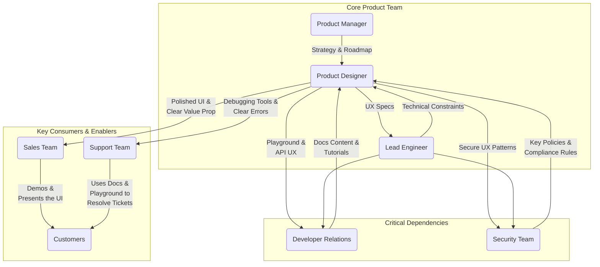

# Developer API Portal: Persona & Stakeholders

This document defines the target user persona for the Developer API Portal and maps the internal stakeholders involved in its success.

## 1. Primary Persona: "Alex" - The External Developer

We adapt our existing "Alex" persona to represent an external developer integrating with FleetEdge.

*   **Who is Alex?**
    *   A software engineer at a third-party company (e.g., a logistics partner, an insurance provider, a large customer with an in-house data team).
    *   Tasked with building new features or services that rely on FleetEdge's data.
    *   Technically proficient, lives in their IDE and terminal, values speed and efficiency.

*   **Alex's Goals & Motivations:**
    *   **Goal:** "I need to get vehicle telematics data from FleetEdge into my application."
    *   **→ Why?** "So I can build a new feature for my company that predicts delivery times."
    *   **→ Why?** "If I can get a prototype working quickly, my project will get funded."
    *   **→ Root Need:** **"I need a fast, frictionless, and reliable way to access fleet data so I can prove the value of my project and ship my feature on time."**

*   **Key Traits & Frustrations:**
    *   **Values:** Clear documentation, self-service tools, automation, and elegant APIs.
    *   **Hates:** Ambiguous instructions, waiting for people, slow UIs, and having to talk to sales just to try an API.
    *   **Fears:** Wasting a whole day on a dead-end integration, building on an unreliable or poorly documented API, and getting hit with unexpected charges.

---

## 2. Counter-Personas & Edge Cases

A robust platform must serve more than just the primary persona. The design considers these edge cases:

*   **Priya - The Junior Integrator:** Less experienced than Alex. She relies heavily on high-quality documentation, clear examples, and the ability to "try before you buy." The interactive playground is her most critical feature.
*   **David - The Internal Platform Admin:** An engineer at FleetEdge. He needs tools to manage the API marketplace itself, onboard new APIs, and view system-wide analytics. His "user interface" is the backend configuration for the portal.
*   **Maria - The Security & Compliance Officer:** She never uses the API directly, but she needs to be able to audit its usage. She requires exportable logs and a clear view of who has access to what data, and for how long. The `AuditCard` and key expiration features are designed for her.

---

## 3. Stakeholder Map (Design Dependencies)

This map is reframed to highlight design dependency and collaboration, not just influence. It answers: "Who do we need to work with to make this design a success?"

### Stakeholder Breakdown:

*   **Core Product Team:** The daily collaborators responsible for strategy and execution.
*   **Critical Dependencies:** These teams are essential partners. The design cannot succeed without their direct input and collaboration.
    *   **Developer Relations:** They are the voice of the developer and the primary consumer of the portal's documentation and playground features for their own content.
    *   **Security Team:** They define the constraints and best practices that the UX must embody to keep the platform and its users safe.
*   **Key Consumers & Enablers:** These teams are the internal "users" of the design. A successful design makes their jobs easier.
    *   **Sales:** A great developer portal is a powerful sales tool.
    *   **Support:** A clear, self-serve UI with good error handling directly reduces support ticket volume. 