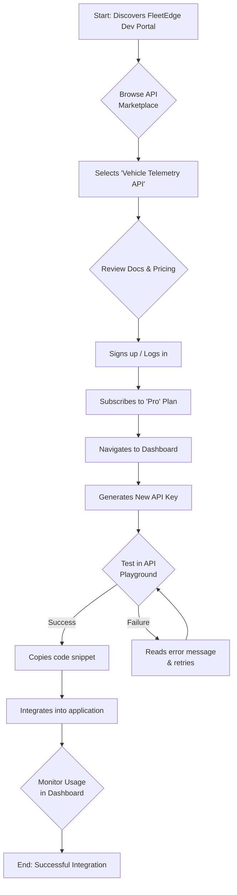

# Developer API Portal: Workflow & User Journey

This document visualizes the developer's path through the API portal, from initial discovery to successful integration.

---

## 1. High-Level Developer Workflow

This diagram shows the ideal, end-to-end flow for a developer using the FleetEdge platform.



---

## 2. Cross-Functional System Touchpoints

A developer's interaction with the API portal doesn't happen in a vacuum. The design must account for the entire lifecycle of an event, from the UI to back-end systems, sales, and support. This diagram shows the journey of a single event, like an API key being created or a rate limit being exceeded.

```mermaid
graph TD
    subgraph "Developer Portal (UI/CLI)"
        A[1. User Action<br/>(e.g., Generate Key, Exceed Quota)]
    end

    subgraph "Platform Services"
        B[2. API Backend<br/>Logs Event] --> C{3. Billing Service<br/>Checks Plan Limits};
        C --> D[4. Alerting Service<br/>Triggers Webhook/Email]
    end

    subgraph "Business & Support Systems"
        E[5. CRM / Sales Tool<br/>(Notified of high usage trial)]
        F[6. Support Platform<br/>(Ticket created if error persists)]
    end
    
    subgraph "Security & Audit"
        G[7. SIEM / Audit Log<br/>(Action stored for forensics)]
    end

    A --> B;
    D --> A;
    C --> E;
    D --> F;
    B --> G;
```

---

## 3. Failure Mode Mapping & Service Design

A resilient system is designed with failure in mind. This section maps out potential failures and considers their impact not just on the end-user, but on our internal teams (a service design perspective).

| Potential Failure | User-Facing Impact | Internal (Service Design) Impact | Our Design Mitigation |
| :--- | :--- | :--- | :--- |
| **Webhook delivery fails** | Developer's application doesn't receive a critical, time-sensitive event (e.g., `vehicle.emergency_braking`). | • **Support Team:** Ticket queue floods with "your webhooks are broken" complaints.<br/>• **DevRel Team:** Loses credibility with developers. | • **Webhook Event Log:** A dashboard view where developers can see a log of all sent webhooks and their delivery status (`Success`, `Failed`, `Pending`).<br/>• **Automated Retries:** System automatically retries failed deliveries with exponential backoff.<br/>• **Proactive Alerting:** Alert the user after 3 consecutive failures. |
| **Rate limit breached mid-request** | A critical process (e.g., end-of-day reporting) fails halfway through, leaving data in an inconsistent state. | • **Support Team:** Gets complex tickets about data integrity.<br/>• **Engineering Team:** May need to manually clean up corrupted data. | • **"Dry Run" Flag:** For critical endpoints, offer a flag to check if the full request would exceed the rate limit without actually executing it.<br/>• **Granular Usage Stats:** Allow developers to see usage per key and per endpoint, so they can better forecast their needs. |
| **Onboarding a new API (Internal)** | A new API is added to the platform, but the documentation is incomplete, or the playground isn't configured correctly. | • **DevRel & Docs Team:** Scrambles to fix public-facing content post-launch.<br/>• **Product Team:** Launch is perceived as sloppy. | • **API Onboarding Checklist:** A standardized internal process. A new API cannot be made public until it has complete documentation, a configured playground, and passing health checks. This makes the *design system* a part of the *internal service* of launching an API. |

---

## 4. Alternate Journeys & Entry Points

A developer's journey is not always linear. The design must account for users entering the workflow from different contexts.

*   **The "Docs-First" Journey:**
    *   **Entry Point:** A developer finds a FleetEdge tutorial on a blog or in our official documentation.
    *   **Key UX Feature:** The documentation contains an embedded "Run in Playground" button next to a code example.
    *   **Flow:** Clicking this button deep-links the user directly into the **API Playground** (Screen 2), pre-populating it with the relevant example code. If the user isn't logged in, they are prompted to do so first, and are then seamlessly redirected to the pre-loaded playground.

*   **The "Alert-Driven" Journey:**
    *   **Entry Point:** A developer receives a rate-limiting email alert or a security warning about a key.
    *   **Key UX Feature:** The email contains a direct link to the relevant page.
    *   **Flow:** Clicking "View Usage" in the email takes them directly to the **Developer Dashboard** (Screen 3), with the relevant API usage chart pre-selected. Clicking "Review Key" takes them directly to the key management section.

*   **The "CLI-to-Web" Journey:**
    *   **Entry Point:** A developer gets an error in the CLI.
    *   **Key UX Feature:** The CLI error message contains a URL.
    *   **Flow:** The CLI suggests a URL like `https://portal.fleetedge.com/keys/fe_sk_...xxxx/scopes` to resolve a permission issue. Clicking this link takes the authenticated user directly to the specific key editing UI in the portal.

---

## 5. Developer User Journey Map

This map details the thoughts, feelings, and pain points of our persona, Alex, at each stage of the workflow.

| Phase | Alex's Goal | Actions | Thoughts & Feelings | Pain Points (Current State) | Opportunities (Our Design) |
| :--- | :--- | :--- | :--- | :--- | :--- |
| **Discovery** | "Does this platform have the data I need?" | • Googles "fleet data api"<br/>• Lands on the FleetEdge marketing page<br/>• Clicks on "Developers" or "API" link | 🤔 "Okay, this looks promising. Is it for real developers or just marketing fluff?"<br/>🤨 "I hope I don't have to talk to a salesperson." | • Can't find the developer portal easily.<br/>• Vague marketing language instead of technical details. | • Prominent "Developers" link in the main nav.<br/>• A clear, compelling value proposition on the landing page. |
| **Consideration** | "Is this API good? Is the price fair?" | • Browses the API marketplace<br/>• Reads the 'Vehicle Telemetry' overview<br/>• Checks the pricing page | 😎 "Nice, a marketplace. This is professional."<br/>🧐 "The 'Basic' plan seems limited. Let's see the pricing."<br/>😒 "The current checkout flow is confusing. What are all these parameters?" | • Confusing, non-standard checkout flow.<br/>• Pricing is unclear or requires a quote.<br/>• No way to see the API quality before committing. | • Clean, card-based API marketplace.<br/>• Interactive pricing page/calculator.<br/>• Publicly visible, high-quality documentation. |
| **Onboarding** | "Get me an API key, fast." | • Signs up for an account<br/>• Subscribes to a plan<br/>• Looks for where to generate a key | 🚀 "Great, I can sign up with GitHub. Easy."<br/>💳 "Standard credit card form, fine."<br/>🙄 "Now I have to wait for an email with a password-protected doc? Seriously?" | • **Manual API key delivery via email.**<br/>• Clunky, insecure password sharing.<br/>• The "Aha!" moment is delayed by hours or days. | • **Instant, self-serve API key generation.**<br/>• Securely display the key once and provide a 'copy' button.<br/>• Immediately forward the user to the API playground. |
| **Testing & Integration** | "Does this actually work as advertised?" | • Opens the API documentation<br/>• Tries to make a test call (e.g., in Postman)<br/>• Gets an error<br/>• Debugs the issue | 😠 "Why did my first request fail? The error is cryptic."<br/>🤔 "Let me re-read the docs carefully."<br/>💡 "Ah, the VIN format is different than I expected."<br/>🥳 "It works! Now to code." | • No built-in testing environment.<br/>• Documentation is incomplete or has no examples.<br/>• Vague error messages (`400 Bad Request`). | • An **interactive API playground** that makes testing trivial.<br/>• Rich code examples in multiple languages.<br/>• Error messages that are specific and helpful. |
| **Usage & Maintenance**| "How much am I using? Are my keys secure?" | • Deploys code to production<br/>• Visits the developer dashboard periodically<br/>• Updates billing info | 😊 "The integration was smoother than I thought."<br/>📈 "Cool, I can see my usage on this chart."<br/>🤔 "I should probably create a new key just for the production environment." | • No visibility into API usage.<br/>• No way to manage keys (rotate, delete).<br/>• Fear of surprise overage charges. | • A clean developer dashboard with usage charts.<br/>• Proactive alerting for quota limits.<br/>• Full CRUD (Create, Read, Update, Delete) functionality for API keys. | 