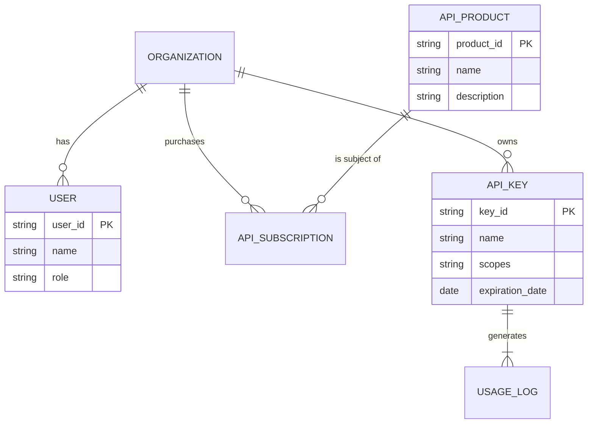
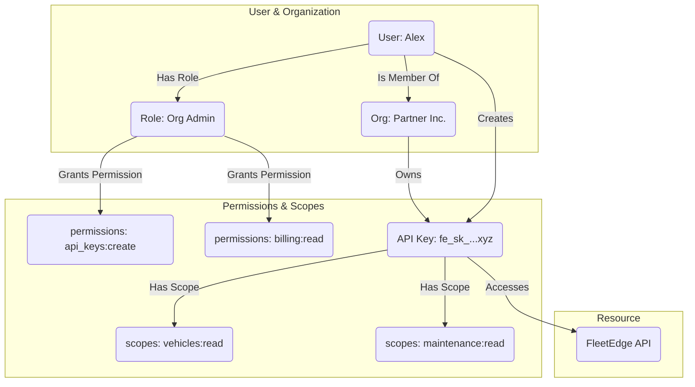

# Developer API Portal: System Architecture & Models

At the staff level, design extends beyond screens to the underlying architecture of the system. This document provides key diagrams that model the information architecture, permission system, and feature parity of the Developer Portal.

---

## 1. Information Model

This diagram shows the relationship between the core entities in the developer portal ecosystem. It illustrates how Users belong to Organizations, which subscribe to API Products, generate Keys, and have their Usage tracked.

---

## 2. Permission & Role System Diagram

This model illustrates how permissions are managed. A User is assigned a Role within an Organization. That Role grants them permissions (e.g., `api_keys:create`). Separately, an API Key is granted Scopes (e.g., `vehicles:read`), which control what data it can access. This separation of user permissions and key scopes is a critical security pattern.

---

## 3. CLI-Portal Feature Parity Matrix

This matrix explicitly defines which features are available in the UI versus the CLI. It ensures we are intentional about the strengths of each interface and where handoffs should occur. A "Yes" indicates full functionality, "Partial" indicates limited functionality, and "No" indicates the feature is not present.

| Feature | Portal UI (Web) | CLI | Rationale / Handoff Point |
| :--- | :--- | :--- | :--- |
| **Discover APIs** | Yes | Partial | UI is for visual browsing. CLI can only `list` subscribed APIs. |
| **Subscribe to New API** | Yes | No | Billing and plan selection is a complex visual flow best suited for the web UI. |
| **Generate API Key** | Yes | Yes | Core functionality for both interfaces. |
| **Set Key Scopes & TTL** | Yes | Yes | Essential security feature, must have parity. |
| **Rotate Key** | Yes | Yes | Core security functionality. |
| **View Usage History (Charts)** | Yes | No | Data visualization is a strength of the web UI. |
| **View Usage History (Raw Data)**| Partial | Yes | CLI is ideal for scripting and fetching raw usage data for analysis. |
| **Update Billing Details**| Yes | No | Secure payment forms are web-only. The CLI can provide a link to the billing page. |
| **Invite Team Members**| Yes | No | User management is a complex workflow best handled in the UI. |
| **Interactive API Testing**| Yes | Yes | The UI offers a visual playground. The CLI offers `api call` for scripting and terminal-based tests. | 